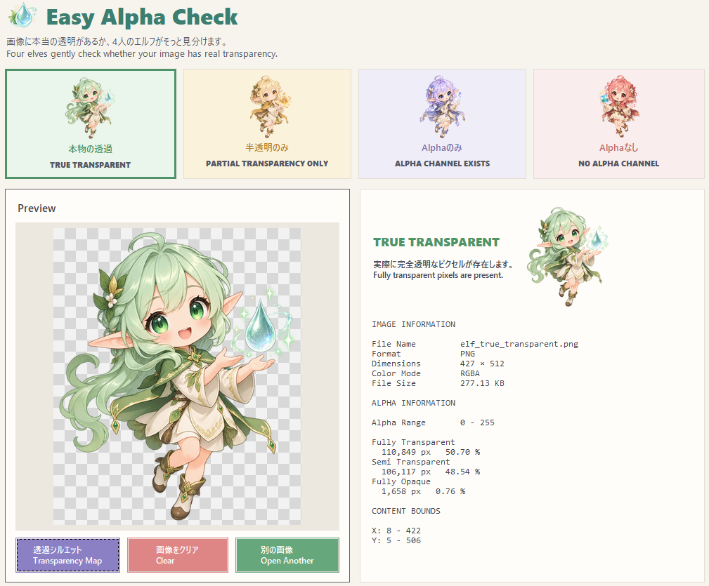
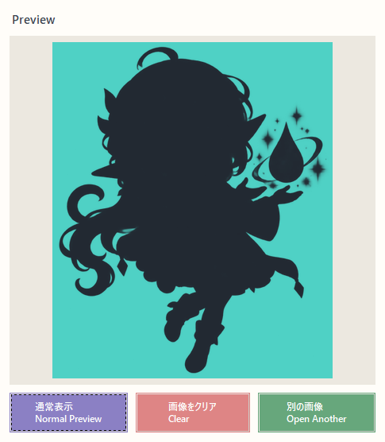

# Easy Alpha Check

**そのPNG、本当に透過できてる？**

画像をドラッグ＆ドロップするだけで、透明・半透明の有無を確認できるWindows向けツールです。
4人のSDエルフが判定結果をご案内。透過シルエットで、髪の隙間や輪郭の内側まで目で確認できます。

画像はPC内で処理します。元画像の上書きや変更は行いません。

  
  

## 主な機能

- **4種類の透過判定** — 完全透明・半透明のみ・Alphaチャンネルのみ・Alphaなしを区別
- **透過シルエット** — 透明な部分を色分けし、細かい隙間の抜け具合を確認
- **通常プレビュー** — 市松模様の背景で画像の見た目を確認
- **詳細情報** — 画像サイズ、透明・半透明・不透明ピクセルの数や割合を表示
- **日本語・英語併記** — 操作ボタンや説明を両言語で表示

## 使い方

1. `EasyAlphaCheck.exe` を起動します。ZIPで入手した場合は、先に展開してください。
2. ウィンドウに画像をドラッグ＆ドロップするか、ファイル選択から開きます。
3. 判定結果とプレビューを確認します。
4. 細かい隙間を確認したいときは、紫色の「透過シルエット / Transparency Map」ボタンで表示を切り替えます。

「通常表示 / Normal Preview」で元の表示に戻せます。「画像をクリア」で表示中の画像を外しても、元のファイルは削除されません。

**exe単体で起動できます。Pythonや追加ライブラリのインストールは不要です。**

## 判定の意味

| 判定 | 意味 |
|---|---|
| `TRUE TRANSPARENT` | 完全に透明なピクセルが含まれています。 |
| `PARTIAL TRANSPARENCY ONLY` | 半透明のピクセルはありますが、完全に透明なピクセルはありません。 |
| `ALPHA CHANNEL EXISTS` | 透明度の情報（Alphaチャンネル）はありますが、全ピクセルが不透明です。 |
| `NO ALPHA CHANNEL` | 透明度の情報がありません。 |

`TRUE TRANSPARENT` は、完全透明なピクセルが1つ以上あるという意味です。背景や髪の隙間がすべてきれいに切り抜かれていることを保証する判定ではありません。

## 透過シルエットの見方

| 色 | 透明度 |
| --- | --- |
| シアン（青緑） | 完全に透明 |
| 濃いグレー | 完全に不透明 |
| その中間の色 | 半透明 |

髪と髪の間など、抜けていてほしい場所がシアンなら、その部分は透明です。濃いグレーなら、不透明なピクセルが残っています。

通常表示と切り替えて、イラストの白い部分と透明な部分を見分けるのにも使えます。

## 対応環境・画像形式

- Windows向けデスクトップアプリ
- PNG / WebP / JPEG / BMP / TIFF などに対応
- ウィンドウの最小サイズは1040 × 900です。画面の解像度や拡大率によっては、全体が収まらない場合があります。
- アニメーション画像や複数ページの画像は、先頭のフレーム・ページを対象にします。
- 壊れた画像、未対応の形式、極端に大きい画像は読み込めない場合があります。

本ツールは透過状態を確認するためのものです。背景除去や透過画像への変換機能はありません。

## ライセンス

[MIT License](LICENSE) — Copyright (c) 2026 nexustide400
